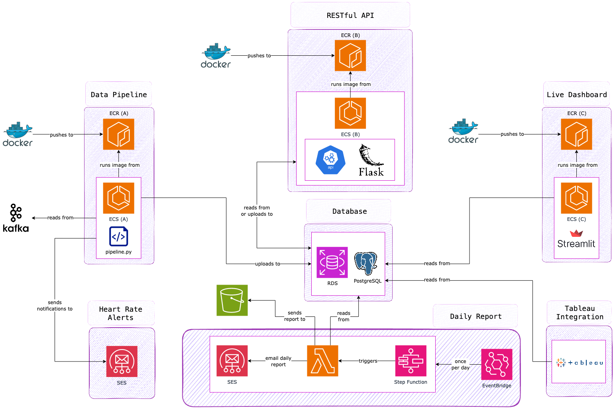

# 🚲 Deloton Bike Analysis Project

## 📝 Project Description
Deloton Exercise Bikes are an internationally famous stationary exercise bike brand. Their aim as a company is to use cutting edge technology to enable their customers to know more about their exercise habits and their own bodies.

Deloton has a range of exercise bikes on the market that track metrics such as heart rate, rotations per minute and power output every second. These metrics are shown to the user on their bike but up until this point Deloton haven't been able to get any of this information in aggregate. However - with their customers' permission - a new update means that they are now collecting data about users and their rides.

Unfortunately, the data that Deloton are collecting from their bikes is unstructured and not clean. 

Our team has been tasked to:
- Create an ETL Pipeline to clean, structure and upload the Deloton Bike data to a data warehouse.
- Create 5 deliverables from this data;
  - Heart Rate Alerts
    - Sending a heart rate alert through email to users with spiking heart rates while they are using the bikes.
  - Live Dashboard
    - A live dashboard of the current ride coming into the database.
  - Daily Report
    - A daily report that contains key statistics from the previous days' data is sent in an email every day at 9.30.
  - RESTful API
    - A API live on the cloud that enables Deloton to perform some queries on the Data Warehouse and standardise this process all across the company.
  - Tableau Integration
    - Create a connection between the Data Warehouse and Tableau so that Data Analysts at Deloton can perform queries and create dashboards for the data.
   
Terraform:
This project contains a terraform folder that has the capability to to provision the infrastructure of the pipeline and deliverables.

Dashboard:
This project contains a dashboard folder. This folder contains the code to run a Streamlit dashboard that can be hosted on AWS.
This dashboard allows us:
- To be able to view the data in real-time
- To view graphs of the latest ride data sent into the data warehouse.

## 🗂️ Repository Contents
- `api` - contains all the code and resources required to create an API using Flask that allows access to the rider data in a secure way.
- `daily_report` - contains all the code and resources required to extract key statistics from an RDS and create an html string to send in a daily report through email.
- `dashboard` - contains all the code and resources required to run the dashboard.
- `database` - contains the code required to set up the database, as well as a script to connect to and reset the database.
- `diagrams` - contains all the diagrams used in planning and designing our approach.
- `pipeline` - contains all the code and resources required to run the pipeline.
- `terraform` - contains all the terraform code required to build the necessary AWS services for running the pipeline on the cloud.

## 🛠️ Setup

Follow the instructions provided in the `README.md` files located in each folder.

## 🏃 Running the pipeline locally

1. To get the pipeline running, navigate to the `pipeline` folder and follow the instructions provided in the `README.md` file
2. Once the pipeline is running, navigate to the `dashboard` folder and follow the `README.md` instructions to run the dashboard

## ☁️ Running the pipeline on the cloud

1. Create five ECR repositories, one for each of the following:
    - `pipeline`
    - `daily-report`
    - `dashboard`
    - `api`
2. Navigate to the each of these folders, and follow the `push commands` provided in the ECR repository to build and upload the Docker images
3. To create the AWS infrastructure required for the pipeline to run on the cloud, navigate to the `terraform` folder and follow the instructions provided in the `README.md` file

### Cloud Architecture:

