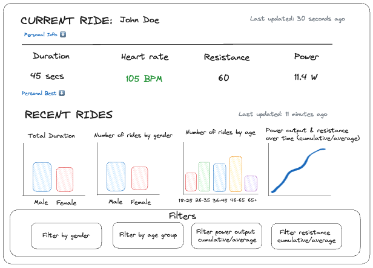
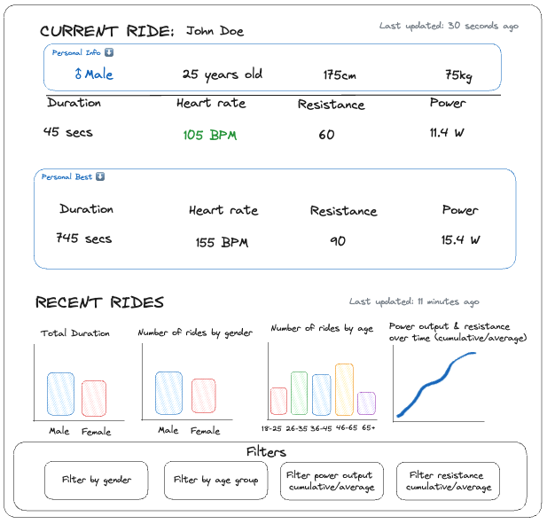

# Deleton Bike Analysis Dashboard

This folder contains all code and resources required to create a Streamlit dashboard from the data generated in the pipeline file. The files in this folder are used to connect to the database, make visualisations and deploy them to a Streamlit app.

## Installation

- It is recommended before stating any installations that you make a new virtual environment (`venv`).

- A new environment will be required for each folder in this repository.

- Install all requirements for this folder by running `pip3 install -r requirements.txt`.

- Create a `.env` file by running `touch .env`

- You need a database called `postgres`.

Required env variables (NEED TO VERIFY):

- `DATABASE_IP` -> ARN to your AWS RDS.
- `DATABASE_USERNAME` -> Your database username.
- `DATABASE_PASSWORD` -> Password to access your database.
- `DATABASE_PORT` -> Port used to access the database.
- `AWS_ACCESS_KEY_ID` -> Your AWS access key ID to connect to AWS.
- `AWS_SECRET_ACCESS_KEY` -> Your AWS secret access key to connect to AWS.

## Wireframe

Collapsed:

Expanded:

