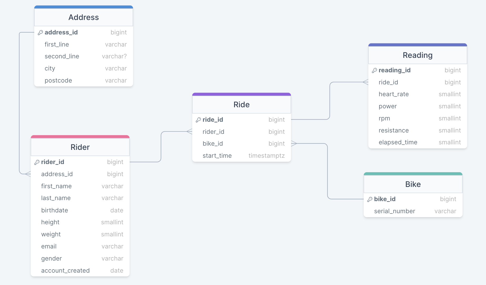

# Database
This folder should contain all code and resources required to handle the Database of the project.

# 📝 Project Description
- This folder contains all the Database instructions and details that are needed to setup the Database required in our project.

## 🔐 Environment Variables
- Create a `.env` file with the following information:
- `DATABASE_IP` -> ARN to your AWS RDS.
- `DATABASE_NAME` -> Name of your database.
- `DATABASE_USERNAME` -> Your database username.
- `DATABASE_PASSWORD` -> Password to access your database.
- `DATABASE_PORT` -> Port used to access the database.

## 🏃 Running the script

Run the database creation with `bash reset_db.sh`

## :card_index_dividers: Files Explained
- `deloton_schema.sql`
    - A sql schema that contains all the tables required in the database to store the deloton data.
- `reset_db.sh`
    - A bash script to reset the database. This drops all tables currently in the database and creates them again.
- `connect_db.sh`
    - A bash script to connect to the database.
 
## Entity Relationship Diagram:

