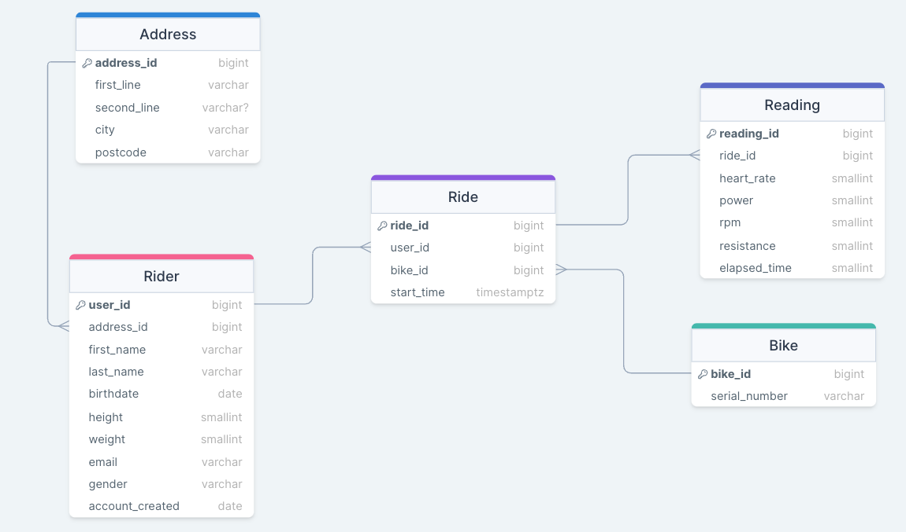
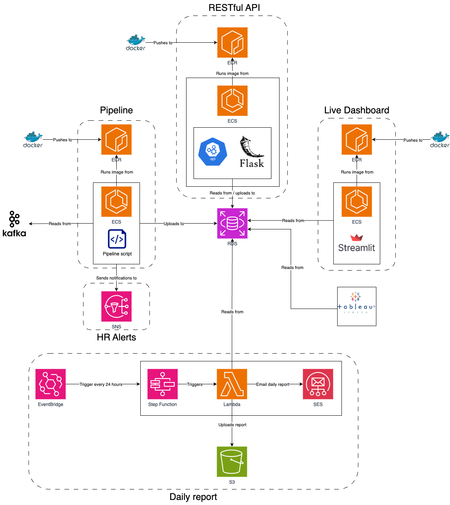

# Diagrams

This directory contains all the relevant diagrams for the architecture, database and dashboard design of the Deloton Project.

## 🗂 Files Explained

 
  * Created to outline an initial design of the dashboard, including features and visualisations that meet the brief and would be beneficial for Deloton and its customers.

 
  * Outlines the different tables used to form our database, including the relationships between the tables and the datatypes for values.

  * Details the architecture diagram designed for the project including all the relevant cloud-based services (AWS) and how they work together.
