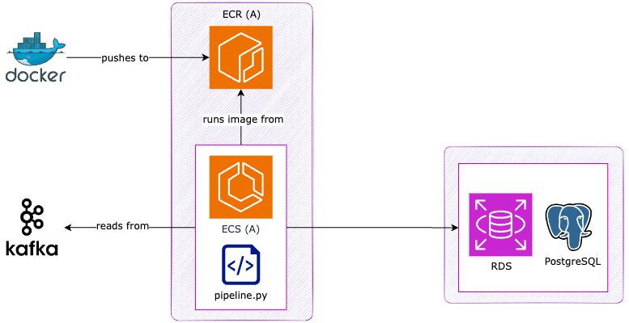

# Pipeline
This folder contains code to connect to the Kafka stream, retrieve log lines, and then extract, transform and upload bike, address, ride, rider and reading data from these to the RDS database, as well as to provide heart rate alerts to users with consistently extreme heart rates.

## 🛠️ Getting Setup
- Install requirements using `pip3 install -r requirements.txt`

## 🔐 Environment Variables
- Create a `.env` file with the following information:
- `DATABASE_IP` -> ARN to your AWS RDS.
- `DATABASE_NAME` -> Name of your database.
- `DATABASE_USERNAME` -> Your database username.
- `DATABASE_PASSWORD` -> Password to access your database.
- `DATABASE_PORT` -> Port used to access the database.
- `AWS_ACCESS_KEY_ID_ `  -> Personal AWS ACCESS KEY available on AWS.
- `AWS_SECRET_ACCESS_KEY_` -> Personal AWS SECRET ACCESS KEY available on AWS.
- `KAFKA_TOPIC` -> The current kafka topic to subscribe to.
- `BOOTSTRAP_SERVERS` -> Name of the kafka server.
- `SECURITY_PROTOCOL` -> Name of the security protocol for the kafka stream.
- `SASL_MECHANISM` -> Name of the simple username/password authentication mechanism for the kafka stream.
- `USERNAME` -> Username for kafka account to access the input stream.
- `PASSWORD` -> Password for kafka account to access the input stream.
- `BUCKET_NAME` -> Name of the S3 Bucket all data gets sent to.

## 🏃 Running the pipeline locally

Run the command `python3 pipeline.py`

### Dependencies:
 - `transform.py`
    - `get_user_from_log_line`
    - `get_ride_data_from_log_line`
    - `get_reading_data_from_log_line`
 - `load.py`
    - `add_user`
    - `add_ride`
    - `add_reading`
    - `add_bike`
 - `validate_heart_rate`
    - `calculate_max_heart_rate`
    - `calculate_min_heart_rate`

## Modules

### pipeline.py
This module contains the script to establish connection to Kafka stream, retrieve log lines, and then transform and upload the relevant data to the database (using functions from the `transform.py` and `load.py` files as necessary).

As part of the pipeline, user's max and min heart rates are calculated using functions from `validate_heart_rate.py`, and their heart rate given in the readings compared against them; if this falls outside the healthy range too many times in a row (the limit is set by the constant `EXTREME_HR_COUNT_THRESHOLD`), the `validate_heart_rate` function send_email is used to alert the user.

The pipeline is defined as a class (`Pipeline`), with one public method `pipeline()`, which is used to run the ETL pipeline until user interrupt or failure. A subclass, `BackfillPipeline`, inherits from this class, overriding several functions such that its own version of the public method `pipeline()` is optimised for speed, using multiprocessing to handle the ride data in batches; this pipeline does not support the heart rate notification functionality, as it is not intended to be used with live data.

The `main()` function creates an instance of the `BackfillPipeline` class, and runs its `pipeline()` method until the last ride processed started in the hour and day in which the script is being run; it then creates an instance of the `Pipeline` class, and runs its `pipeline()` method until user interrupt or failure.

### transform.py
This module contains functions used by the pipeline to extract and transform bike, address, ride, rider, and reading data from log lines retrieved from the the Kafka cluster (by the `pipeline.py` script).

### validate_heart_rate.py
This contains functions used to calculate the maximum and minimum safe heart rates for a rider, given their age and gender, as well as a function to send a heart rate alert email to a rider through SES.

The heart rate thresholds are set based on the maximum heart rate for the rider based on their age and gender (where gender is 'other', we have erred on the side of caution, and calculated the range as if they were a woman, as their span for a healthy heart rate is narrower than that of a man of a similar age). Several formulas are used to ensure accuracy for different categories of riders.
These are:
- Gulati Formula (women): 206 - (0.88 x age)
- Tanaka Formula (men over age 40): 208 - (0.7 x age)
- Fox formula (men under age 40): 220 - age

The threshold for a minimum heart rate is assumed to be the lower end of an athletes
resting heart rate to also accommodate for high performance riders.
These are:
- Men 18-39: 40
- Men 40-64: 47
- Men 65+: 52
- Women 18-39: 45
- Women 40-64: 52
- Women 65+: 57

### load.py
This module contains functions used by the pipeline to upload the extracted and transformed data to the RDS, or to return the id of the entries containing said data if it already exists in the database.

### database_functions.py
This module contains functions which interact directly with the database, inserting or selecting data. These have been separated into their own module to try to abstract the SQL queries used to interact with the database away from the other parts of the script, as well as with a view to eventually develop this module into a python package that can be used by all the outputs of this project, and to provide a complete and consistent database interface for Deloton.

## ☁️ Cloud Architecture:

